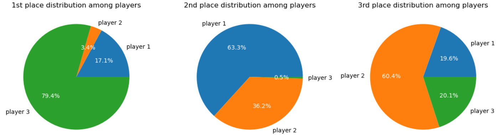
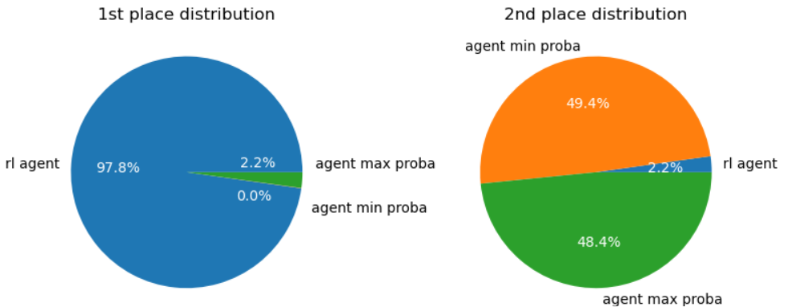
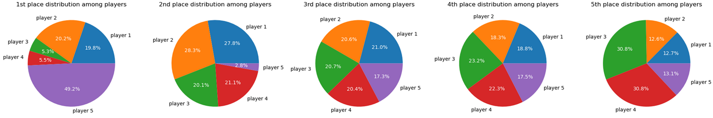

# Learning Liar's dice with deep Q-learning
<!-- badges -->


A reinforcement learning application to Liar's Dice.

## To do list
- [x] Add mlflow ? Not now
- [x] Streamlit app ? Next step
- [ ] Convert bet into tuples. 
- [x] Replacing np.stack with np.array in optimize_model function
- [x] Test training without weight decay
- [x] Update variables in demo notebook
- [x] Remove perudo references
- [ ] Rename deterministic agent to fixed agent
- [x] Added MIT license correctly
- [x] Installation process correctly
- [x] Add badges

## Overview
This project explores the application of deep reinforcement learning to Liar’s Dice, an imperfect-information, turn-based bluffing game.  
This document presents the game mechanics, key reinforcement learning concepts, and their application to this setting.  
The [demo](demo.ipynb) notebook shows how to use the code to simulate games and train an agent using deep reinforcement learning.

**Results highlight:** The trained DQN agent achieves ~80% first place rate vs. two simple rule-based opponents after 4000 training games. (See [Result analysis](#result_analysis) for plots and metrics.)

## Key Features
- Custom Liar’s Dice game environment in Python.
- Fixed baseline opponents.
- Visual tools for data analysis.
- Reinforcement learning modeling (state format, episode definition, reward definition).
- DDQN with action masking algorithm implementation in PyTorch.
- Project's in an interactive notebook.

## Installation

This project uses **conda** for environment management.

```bash
git clone [https://github.com/Aff54/Reinforcement-learning-applied-to-Liar-s-dice]

cd your-repo

conda create --name liars_dice_rl --file requirements.txt
conda activate liars_dice_rl
```

## Table of contents
1. [Liar's dice game explanation](#game_presentation)  

2. [Reinforcement learning theory](#rl_theory)  
    2.1 [Core idea](#general_idea)  
    2.2 [Q-learning](#q_learning)  
    2.3 [DQN algorithm](#DQN_algorithm)  
    2.4 [DDQN update](#DDQN_update)  
    2.5 [Masking](#masking)  

3. [Training an agent with reinforcement learning](#rl_application)  
    3.1 [Environment setup](#env_setup)  
    3.2 [RL framework application](#rl_framework_application)  
    3.3 [RL Training loop](#)  

4.[Result analysis](#result_analysis)
    4.1 [Agent performance](#agent_performance)
    4.2 [3rd place ratio discussion](#3rd_place_ratio_discussion)
    4.3 [Conclusion](#conclusion)

5. [Possible improvements](#possible_improvements)

## 1. Liar's dice game explanation <a name="game_presentation"></a>

Liar’s Dice is a turn-based bluffing game with imperfect information.  
Each player starts with 5 dice. At the beginning of each round, all players roll their dice privately, then take turns making a **bet** about the number of dice showing a certain value among all dice in play.

On their turn, a player must either **outbid** the previous **bet** or **challenge** it.

---

### Bet format
A bet is written as `[q, v]` and means: *there are at least `q` dice showing face `v` across all dice at play*.  
**Ones are wild**: when `v ≠ 1`, dice showing `1` also count toward as the face of current bet.

---

### Outbidding rules
Given the previous bet `[q, v]`, a legal outbid must satisfy **one** of the following conditions:

- Increase the face value while keeping the same quantity: `[q, v′]` with `v′ > v`
- Increase the quantity with any face: `[q′, v′]` with `q′ > q`

Additional constraints apply when switching between wilds and non-wilds:
- From wilds to non-wilds (`[q, 1] → [q′, v′ ≠ 1]`):  
  the new quantity must satisfy  
  `q′ ≥ 2q + 1`
- From non-wilds to wilds (`[q, v ≠ 1] → [q′, 1]`):  
  the quantity may decrease, but must satisfy  
  `q′ ≥ ceil(q / 2)`
  *(this is the only way to reduce the quantity in a bet)*

---

### Challenging previous player
Instead of outbidding, a player may challenge the previous bet by calling either **"liar"** * or **"exact"**. In this case, dice are revealed and previous bet validity is checked.

- **"Liar"**: 
  If the true count of dice showing `v` (and/or `1`) is **≥ q**, the challenger loses one die; otherwise the previous player loses one die.
- **"Exact"**: if the challenger calls *exact* and the true count equals `q`, the challenger gains one die back; otherwise the challenger loses one die.

---

### Note
Many Liar’s Dice variants exist; only the rules described above are implemented in this project.

## 2. Reinforcement learning theory <a name="rl_theory"></a>

### 2.1 Core idea <a name="core_idea"></a>
Reinforcement learning (RL) is a branch of machine learning. It is a framework for training agents to make decisions in an environment by interacting with it.  
An RL problem is commonly modeled as a Markov Decision Process (MDP) defined by the tuple  
$(\mathcal{S}, \mathcal{A}, \mathbb{P}, r, \gamma)$, where:

- $\mathcal{S}$ is the state space and $\mathcal{A}$ the action space,
- $\mathbb{P}(s' \mid s, a)$ is the probability of transitioning from state $s$ to $s'$ after taking action $a$,
- $r(s,a,s')$ is the reward for taking action $a$ in state $s$ and transitioning to $s'$,
- $\gamma \in (0,1)$ is the discount factor.

At time $t$, the agent observes a state $S_t \in \mathcal{S}$, selects an action $A_t \in \mathcal{A}$ according to a policy  
$\pi(a \mid s) = \mathbb{P}(A_t = a \mid S_t = s)$, receives a reward $R_{t+1}$, and transitions to the next state $S_{t+1}$.

The **action-value function** (Q-function) under a policy $\pi$ is defined as the expected discounted sum of future rewards obtained by taking action $a$ in state $s$:
```math
Q_{\pi}(s,a) =
\mathbb{E}_{\pi}\Big[\sum_{t=1}^{\infty} \gamma^{t} R_{t}
\,\Big|\, S = s, A = a\Big].
```

The goal of reinforcement learning is to find an optimal policy $\pi^*$ that maximizes the Q-function:
```math
Q_{\pi^*}(s,a) = \max_{\pi} Q_{\pi}(s,a).
```

The optimal Q-function satisfies the **Bellman optimality equation**:
```math
Q_{\pi^*}(s,a) =
\mathbb{E}_{S' \sim \mathbb{P}(\cdot \mid s,a)}
\Big[r(s,a,S') + \gamma \max_{a'} Q_{\pi^*}(S',a')\Big].
```

### 2.2 Q-learning <a name="q_learning"></a>

Q-learning is a reinforcement learning algorithm designed to learn an optimal policy $\pi^{*}$ by iteratively approximating the optimal action-value function $Q_{\pi^{*}}$.

The main idea is to initialize the Q-function values $Q(s,a)$ for all state–action pairs, either randomly or with zeros.  
In the tabular setting, these values are stored in a **Q-table**.

The agent then interacts with the environment. At each interaction step, it:
- observes the current state $s$,
- selects an action $a$, typically using an **exploration strategy**,
- receives a reward $r$ and transitions to a new state $s'$,
- updates the corresponding Q-value using the Bellman optimality target.

The Q-learning update rule is:
```math
Q(s,a) \leftarrow (1- \alpha)Q(s,a)
+ \alpha \Big[r + \gamma \max_{a'} Q(s',a')\Big],
```
where $\alpha \in (0,1)$ is the learning rate.

By repeatedly applying this update, the **Q-function** converges toward the **optimal Q-function**, and an optimal policy can be:
```math
\pi^*(s) = \arg\max_a Q(s,a).
```

The **exploration strategy** used in this project is $\varepsilon$-greedy:
- at time $t$ and state $s$, the agent chooses a random action  
  $A_t \sim \mathcal{U}(\mathcal{A})$ with probability $\varepsilon_t$,
- otherwise, it selects the greedy action  
  $A_t = \arg\max_a Q(s,a)$ with probability $(1 - \varepsilon_t)$.

The exploration rate $\varepsilon_t$ decreases over time, from $\varepsilon_{\max}$ to $\varepsilon_{\min}$.  
This allows the agent to first explore a wide range of strategies and gradually focus on improving those that perform best.


### 2.3 DQN algorithm <a name="DQN_algorithm"></a>
A major limitation of tabular Q-learning is that it becomes impractical when the state or action space is large.

Deep Q-Networks (DQN) address this limitation by approximating the **Q-function** with a **policy neural network**
$Q_\theta$ parameterized by weights $\theta$.

Rather than solving Bellman’s optimality equation directly, DQN minimizes the **temporal-difference (TD) error**
between the current Q-value estimate and a target value.

TD error is defined as:
```math
Q_{\theta}(s, a) - \big[r + \gamma \max_{a'} Q_{\theta^-}(s', a') \big]
```
where $Q_{\theta^-}$ is a **target network** whose parameters are held fixed for several training steps to stabilize learning, $Q_{\theta}(s, a)$ the Q-value estimate and $r + \gamma \max_{a'} Q_{\theta^-}(s', a')$ the target value.

The Q-network is trained by minimizing the loss:
```math
\mathcal{L}(\theta) = \sum_{(s, a, r, s') \in \mathcal{B}} l\big(
Q_{\theta}(s, a) - \big[r + \gamma \max_{a'} Q_{\theta^-}(s', a') \big] \big)
```
on a set of $(s, a, r, s')$ tuples stored inside a **replay buffer** $\mathcal{B}$. Usually, the loss function $l$ used for DQN is the Huber loss.

The training loop follows these steps:
- the agent observes a state $s$ and selects an action $a$ using an exploration strategy (e.g. $\varepsilon$-greedy),
- it transitions to state $s'$, receives reward $r$, and stores the transition $(s,a,r,s')$ in the replay buffer,
- minibatches of transitions are sampled from the buffer to update $\theta$ via gradient descent,
- the target network weights $\theta^-$ are periodically updated with $\theta^- \leftarrow \tau \theta + (1 - \tau) \theta^-$.

### 2.4 DDQN update <a name="DDQN_update"></a>
During DDQN training, the **Q-network** tend overestimate state-action values which can lead to a suboptimal policy and unstable training.

As a solution, the **double DQN (DDQN)** updates the TD error to:
```math
Q_{\theta}(s, a) - \big[r + \gamma  Q_{\theta^-}(s', argmax_{a'}Q_{\theta}(s', a')) \big]
```

This way, the action in the target value is selected using the **policy network** but its Q-value is still computed by the **target network**.


### 2.5 Masking <a name="masking"></a>
In the case of state-dependent actions, some actions may be illegal in a given state. Since the Q-network outputs a value for every action in $\mathcal{A}$, **action masking** is used to prevent the agent from selecting invalid actions.

The core idea is to set a very large negative Q-value to illegal actions for preventing the agent from selecting it.

In the case of DQN with an $\varepsilon$-greedy policy, masking is applied as follows:
- the agent observes a state $s$,
- the Q-network computes the Q-value of every action (both legal and illegal):
```math
\{ q_{s, a} = Q(s, a) \mid \forall a \in \mathcal{A} \}
```
- Q-values corresponding to illegal actions are masked:
```math
q_{s, a} \leftarrow -10^9 , \forall a \in \mathcal{A}_{illegal}
```
- the agent chooses the action with the highest Q-value: 
```math
a = \text{arg max}_{a}\{q_{s, a}\}_{a \in \mathcal{A}}
```
During exploration steps, random actions are sampled **uniformly among legal actions only**.

Additionally, in DDQN, masks are also applied in optimization steps: when selecting the next action using the (policy) network, illegal actions are masked **before** applying the $\arg\max$ operator.


## 3. Training an agent with reinforcement learning <a name="rl_application"></a>


### 3.1 Environment setup <a name="env_setup"></a>  

This project aims to train an agent to play Liar’s Dice against **2 to 4 opponents**.

To train the agent and evaluate its performance, the opponents are modeled using **fixed policies**. These opponents do not learn.

---

#### Fixed opponent policies

Three baseline opponent types are implemented:

- **Survivalist policy**  
  At each turn, this agent selects the legal action (calling *"liar"*, *"exact"*, or outbidding) with the **highest estimated probability of being true**, given its current hand.  
  In case of ties, the most aggressive action (highest quantity and/or value) is chosen.

- **Aggressive policy**  
  At each turn, it selects the action with the **lowest probability of being true** among those whose probability exceeds a predefined threshold (50% by default). This policy favors high quantity/value bets while maintaining a minimum survival probability.

- **Random policy**  
  At each turn, this agent selects a legal action at random.

For survivalist and aggressive policies, action probabilities are computed using a **binomial distribution conditioned on the player’s hand**.

---

#### Game setup

To keep training times under an hour, the results presented in this repository were obtained using the following setup:

- the RL agent is trained against **two fixed policies** (survivalist and aggressive),
- each agent starts with **two dice**.

With this configuration, the full training process (warm-up + training loop) took approximately **30 minutes** on average.

Increasing either the number of opponents or dice significantly increased simulation duration. For example, training against two fixed policies with **five dice each** required more than **3 hours**.

---

#### Game variables

Game variables were handled as follows:
- Bets are encoded as `[q, v]`, where `q` is the minimum number of dice showing value `v` across all dice in play.
- A player's hand of n dice is encoded `[d1, d2, ..., dn]`.
- Player order is randomized at the beginning of each game.


### 3.2 RL framework application <a name="rl_framework_application"></a> 
 
The algorithm used for training the agent **against two fixed policies** is **DDQN** based on [PyTorch's DQN tutorial](#https://docs.pytorch.org/tutorials/intermediate/reinforcement_q_learning.html).

---
#### State modeling
The states the agent will transition between contain: the number of dice in previous player hand, the number of dice in next player hand, previous' player bet and the agent's hand.  


Both **last bet** and **the agent's hand** are encoded as **histograms**. This way, states only incorporate quantities. On the other hand, encoding last bet and the agent's hand as `[q, v]` and `[d1, d2, ..., dn]` in states would mix quantitative and qualitative variables. Switching to histograms contributed to significant improvement in the agent's performance.


For instance, if the player before the agent outbid `[2, 3]` with `2` dice in hand, the player after the agent has `1` die in hand, and the agent's hand is `[4, 1]`, the corresponding state is `(2, 1, 0, 0, 2, 0, 0, 0, 1, 0, 0, 1, 0, 0).`

---

#### Terminal states
In the case of Liar's dice, episodes were defined as rounds. Thus, **terminal states** are states observed by the agent just before the end of a round, which can only be ended by a challenge.  
This way, a state-action Q-value accounts for every state and move the agent would witness and take until the end of the round.

Terminal states are encoded as `None` and require no action.

---

#### Transition management
Transitions stored in the replay buffer are composed of: the state witnessed by the agent, selected action, the state it transitioned into, corresponding reward and a legal action mask. The corresponding format is: `(s, a, s', r, mask)`

Legal action masks are arrays of legal action indices in the Q-network output. In the case of terminal states, legal action masks are empty arrays.


Transitions are recorded as follows:
- the agent observes a state `s` and selects an action `a` using an exploration strategy (e.g. $\varepsilon$-greedy),
- players after the agent play,
- the agent observes a new state `s'` with a corresponding reward `r` and stores transition `(s, a, s', r, mask)` in the replay buffer. Then, `s'` will be used as the first state of next transition.

Terminal states happen in three different scenarios: 
- round ended because the agent challenged previous player,
- round ended because the agent outbid and was challenged by the player after,
- round ended because the agent outbid and another player challenged someone else.

---

#### Q-network
The Q-network used in this project is the same as the one in [PyTorch's DQN tutorial](#https://docs.pytorch.org/tutorials/intermediate/reinforcement_q_learning.html). It is a simple neural network with 3 fully connected layers and Relu as the activation function.

<center>

| Neural network parameters     | value      |
| :-------------: | :-------------: |
| Input size (state length) | 15 |
| Output size (total number of possible actions) | 38 |
| Hidden layer size | 64 |
</center>

Every output unit corresponds to a certain action. Thus, every possible action is matched with an index in a python dict before simulating games.

Given the simplicity of the setup (three players with two dice each), this architecture was deemed sufficient for starting with; and showed to be sufficient (See [Result analysis](#result_analysis)).


### 3.3 RL Training loop <a name="training_loop"></a>

The algorithm used for training the agent is DDQN with masking.

---

#### Warm up
Since the Q-network is trained on transitions sampled from the replay buffer, a warm-up phase is used to fill the buffer before training begins.
During this phase, the agent follows the $\varepsilon$-greedy policy with $\varepsilon$ set to $\varepsilon_{max}$.

---

#### Deep learning parameters
Deep learning parameters were selected across experiments. Following values are the ones used for producing results presented in [Result analysis](#result_analysis).

<center>

| Parameter     | Value      |
| :-------------: | :-------------: |
| Batch size | $256$ |
| Learning rate | $3 \times 10^{-3}$ |
| Loss function | Huber loss |
| Metric function | Average $L_1$ norm |
| weigth decay factor ($\lambda$) | $10^{-2}$ |
</center>

Weight decay was added because it improved the agent’s performance during offline training. However, it did not lead to a noticeable improvement during online training.

---

#### RL parameters
Reinforcement learning parameters were selected across experiments. Following values are the ones used for producing results presented in [Result analysis](#result_analysis).

<center>

| Parameter     | Value      |
| :-------------: | :-------------: |
| Warm-up duration (in games) | $300$ |
| Training duration (in games) | $5000$ |
| Testing duration (in games) | $1000$ |
| Discount factor ($\gamma$) | 1 |
| soft update factor ($\tau$) | $10^{-3}$ |
| maximum exploration rate ($\varepsilon_{max}$) | 1 |
| minimum exploration rate ($\varepsilon_{min}$) | 0.2 |
| exploration decay rate $T$ | $\frac{10^3}{3 \ \text{ln}(10)}$ |
</center>

The exploration rate $\varepsilon$ is handled by the `epsilon_rate_scheduler` class. It follows an exponential decay defined by:
```math
\varepsilon_t = \varepsilon_{min} + (\varepsilon_{max} - \varepsilon_{min}) e^{ - \frac{t}{T}}
```
The choice of the exponential decay was arbitrary and it could be changed to a linear decay.

Since episode (round) duration is finite, the discount factor $\gamma$ was set to 1.


<!-- The term $\frac{10^5}{3 \ \text{ln}(10)}$ served to get $ e^{ - \frac{t}{T}} \leq 10^-{3} $ when $t \geq 10^5$ because offline training tests usually lasted $10^5$ optimization steps on average. Further testing during online training showed that $\frac{1}{4}  \frac{10^5}{3 \ \text{ln}(10)}$ increased convergence speed. -->

The decay rate was chosen so that $\varepsilon$ reaches $\varepsilon_{min}$ in approximatively $1000$ games.

Results presented in [Result analysis](#result_analysis) used the following reward system:

<center>

| Situation     | Reward      |
| :-------------: | :-------------: |
| Agent called liar and was right | 1 |
| Agent was called liar or was called liar and lost a dice | -2 |
| Agent called exact and earned a die back | 2 |
| Agent outbid without being challenged | 0 |
| Agent was challenged and challenger lost a dice chalenge | 1 |
| Agent outbid, next player called exact and earned a dice back| -0.5 |
| Game ended without the agent challenging or being challenged | 0 |
</center>

Rewards were chosen for encouraging the agent to make other players lose a dice while prioritizing its own survival.


## 4. Result analysis <a name="result_analysis"></a>


### 4.1 Agent performance <a name="agent_performance"></a>

The following figure shows the ranking distribution (first/second/third) of the three players - Survivalist (player 1), Survivalist (player 2) and the RL agent (player 3) - across **5,000** evaluation games played after training.



The trained agent achieved first place in **79.4%** of games with parameters presented in [Section 3](#rl_application).


### 4.2 3rd place ratio discussion <a name="3rd_place_ratio_discussion"></a>

The ranking distribution shows the agent is substantially more likely to finish third than second. While this may appear counterintuitive at first, it can be explained by analyzing its performance in a 1-vs-1 setup.

Below figure 2 shows the agent’s ranking distribution against one policy at a time (chosen randomly) for 5000 games.



In these 1-vs-1 matches the agent won **97.8 %** of games. This suggests that when the agent survives to a head-to-head situation, it is much more likely to finish first. 

Thus, the agent's performance in a three-player setup can be interpreted as: the agent either gets eliminated first (20.1 % of games) or survives to reach a 1-vs-1 situation and win almost every time.

This interpretation is supported by the below pie charts showing the ranking distribution in a five-player setup (5000 games). As in a three-player setup, the agent's second place ratio is substantially lower than every other place ratio.



The fact that the agent strugles more when multiple players are involved may be explained by the fact that the game is more chaotic with multiple players: since players can only outbid, bets depend on previous players bets and their policies. 


### 4.3 Conclusion <a name="conclusion"></a>

This repository provides a framework for simulating Liar’s Dice with fixed opponents and for training agents using  **DDQN with action masking**. With the configuration presented in this report (three players, two dice each), the trained agent reached first place in **79.4%** of games.

The framework can scale to more players and more dice, but at the cost of significatively increased training times.


## 5. Possible improvements <a name="possible_improvements"></a>

Multiple improvement directions were identified while working on this project:

- training loop computation time could be improved by speeding up fixed policy–related functions in [action_management.py](src/action_management.py) and [deterministic_agents.py](src/deterministic_agents.py). These functions were written to highlight their logic but were not optimized for computational performance,
- episode definition could be extended from rounds to full games. Taking the end of a game as the only terminal state would encourage the agent to account for action consequences across multiple rounds,
- episode history could be taken into account by adding past bets made by all players during the current round to the state representation,
- policy identity could be incorporated by including player policies in the state and adding an embedding layer to the Q-network.

Some of these improvements may be added in a future update.


## Links
- PyTorch's reinforcement learning tutorial : https://docs.pytorch.org/tutorials/intermediate/reinforcement_q_learning.html
- Methods for improving DQN: https://towardsdatascience.com/techniques-to-improve-the-performance-of-a-dqn-agent-29da8a7a0a7e/
- DDQN algorithm explanation : https://apxml.com/courses/intermediate-reinforcement-learning/chapter-3-dqn-improvements-variants/double-dqn-ddqn
